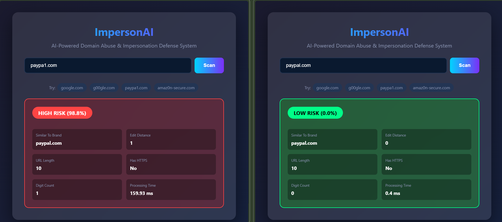
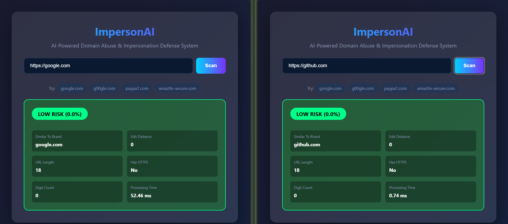
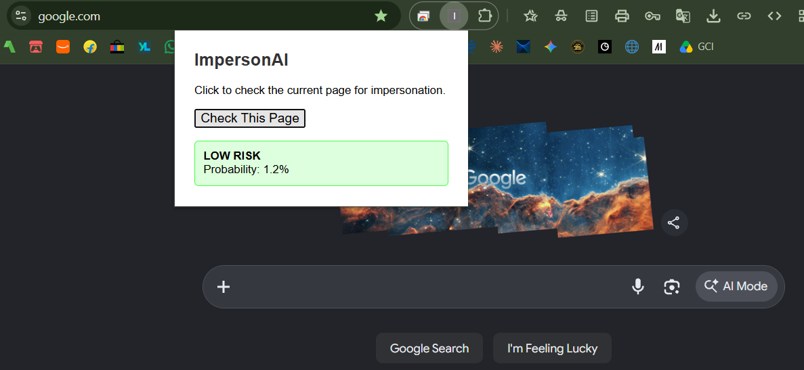
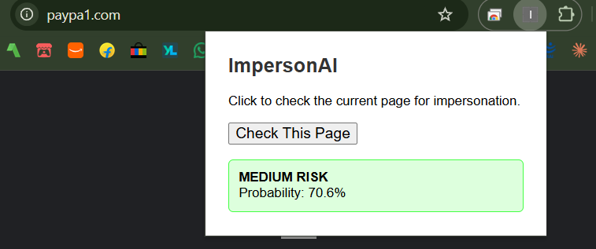
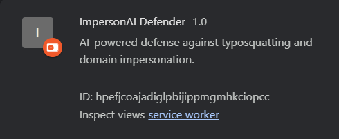

# ImpersonAI

### AI-Powered Domain Abuse & Impersonation Defense System

[](https://python.org)
[](https://fastapi.tiangolo.com)
[](https://xgboost.readthedocs.io)
[](https://developer.chrome.com/docs/extensions/mv3/)
[](LICENSE)

> A real-time, AI-powered defense system that detects typosquatting domains and impersonation attacks — with a live Chrome extension that blocks dangerous links before users click them.

---

# Overview

**ImpersonAI** is an end-to-end cybersecurity system designed to detect and prevent domain abuse and brand impersonation attacks. Attackers increasingly use AI-generated phishing domains and lookalike URLs to impersonate trusted brands. Traditional signature-based defenses cannot keep up.

ImpersonAI combines:
- **Machine Learning** — an XGBoost classifier trained on 23 lexical URL features
- **Real-time Detection** — sub-10ms inference via FastAPI
- **Browser Integration** — a Manifest V3 Chrome extension that intercepts link clicks
- **Prevention Layer** — full-screen warning overlay blocks navigation to high-risk domains

---

## Key Features

| Feature | Description |
|---------|-------------|
| **Typosquatting Detection** | Detects lookalike domains (`g00gle.com`, `paypa1.com`, `githvb.com`) |
| **Machine Learning Engine** | XGBoost classifier with 23 lexical features + Levenshtein distance |
| **Real-time Inference** | Sub-10ms latency per scan |
| **Chrome Extension** | Intercepts link clicks before the page loads |
| **Active Prevention** | Blocks navigation and shows warning overlay on HIGH RISK |
| **Web Dashboard** | Live UI for scanning domains manually |
| **Auto API Docs** | Swagger UI at `/docs` for testing endpoints |

---
# Architecture of ImpersonAI

```text
┌──────────────────────────────────────────────────────────────┐
│              ImpersonAI - Complete System                    │
│                                                              │
│  ┌────────────────┐    ┌──────────────┐    ┌─────────────┐   │
│  │  Chrome Ext.   │───▶│   FastAPI    │───▶│   XGBoost   │   │
│  │  (detection &  │◀───│   Backend    │◀───│    Model    │   │
│  │   prevention)  │    │              │    │  (23 feats) │   │
│  └────────────────┘    └──────────────┘    └─────────────┘   │
│         │                                                    │
│         ▼                                                    │
│  ┌────────────────┐                                          │
│  │  Web Dashboard │  ←  http://127.0.0.1:8000/ui             │
│  └────────────────┘                                          │
│                                                              │
│  Metrics: 86% Accuracy | 84% Precision | 84% Recall          │
│  Latency: <10ms per scan                                     │
└──────────────────────────────────────────────────────────────┘
```

## Component Breakdown

| Layer | Technology | Purpose |
|-------|-----------|---------|
| ML Engine | XGBoost, scikit-learn | Classifies URLs as legitimate or malicious |
| Backend | FastAPI, Uvicorn | Serves model predictions via REST API |
| Frontend | HTML, CSS, JavaScript | Web dashboard for manual scans |
| Client | Chrome Extension (MV3) | Real-time link interception and blocking |

---

# Screenshots

### 1. Web Dashboard — Live Detection Interface

> *The main dashboard where users can enter any domain and get an instant risk assessment with detailed feature breakdown.*


---

### 2. High Risk Detection — Typosquatting Example

> *Example of the system correctly identifying `paypa1.com` as a HIGH RISK typosquatting attempt against `paypal.com`.*



---

### 3. Low Risk Detection — Legitimate Domain

> *Legitimate domains like `google.com` and `github.com` are correctly classified as LOW RISK. Here, https and http also work very well.*



---

### 4. Chrome Extension Popup

> *Click the extension icon in the toolbar to manually check the current page.*



---

### 5. Link Interception — Warning Overlay

> *When a user clicks a dangerous link, ImpersonAI blocks navigation and displays a warning overlay.*



**PASTE IMAGE HERE:** Take a new screenshot showing the red warning overlay when clicking `paypa1.com` on your `test-click.html` page. If you haven't captured it yet, do so now — it's the most impressive screenshot for your demo.

---

### 6. Chrome Extensions Page

> *The extension loaded in Developer Mode on `chrome://extensions`.*



---

# Tech Stack

| Category | Technology |
|----------|-----------|
| **Language** | Python 3.11+ |
| **ML Framework** | XGBoost, scikit-learn |
| **Feature Engineering** | tldextract, python-Levenshtein |
| **Backend** | FastAPI, Uvicorn |
| **Frontend** | HTML5, CSS3, Vanilla JavaScript |
| **Browser Client** | Chrome Extension (Manifest V3) |
| **Data Processing** | pandas, NumPy |

---

# Model Performance

Trained on **3,000+ samples** with balanced classes (~55% legitimate, ~45% malicious):

| Metric | Score |
|--------|-------|
| **Accuracy** | 86.1% |
| **Precision** | 84.5% |
| **Recall** | 83.9% |
| **F1 Score** | 84.2% |
| **Inference Latency** | < 10 ms |
| **Feature Count** | 23 |

**Feature Categories:**

| Category | Count | Examples |
|----------|-------|----------|
| URL Structure | 4 | length, domain length, path length, query length |
| Character Counts | 10 | digits, letters, special chars, dots, hyphens |
| Domain Features | 5 | subdomain count, has_www, has_ip, has_https |
| Suspicious TLD | 1 | flags `.tk`, `.xyz`, `.top`, etc. |
| Ratios | 1 | digit-to-length ratio |
| Levenshtein | 2 | edit distance & similarity to known brands |

---

## Installation & Setup

### Prerequisites

- Python 3.11+
- Google Chrome (for the extension)
- Git

### 1. Clone the Repository

```bash
git clone https://github.com/vz9087/impersonai-biz-mp.git
cd impersonai-biz-mp
```
### 2. Set Up Python Environment

```bash
# Create virtual environment
python -m venv venv

# Activate (Windows)
venv\Scripts\activate

# Activate (macOS/Linux)
source venv/bin/activate

# Install dependencies
pip install fastapi uvicorn xgboost scikit-learn pandas numpy python-Levenshtein tldextract requests
```
### 3. Generate Training Data & train Model

```bash
# Generate synthetic training dataset
python data/generate_training_data.py

# Train the XGBoost model
python app/train_model.py
```
## Expected Output:

```bash
Total samples: ~3000
Legitimate:    ~1700
Malicious:     ~1400
Ratio:         ~55% legit
...
Accuracy:  0.8606
Precision: 0.8450
Recall:    0.8388
F1 Score:  0.8419
[OK] Model saved to app/model/phishing_model.joblib
```
### 4. Run the Backend

```bash
python app/main.py
```
# The server will start at http://127.0.0.1:8000

| URL | Purpose |
|-----------------|-------|
|http://127.0.0.1:8000/ | API health check |
|http://127.0.0.1:8000/ui	| Web dashboard |
|http://127.0.0.1:8000/docs	| Interactive Swagger API docs |

### 5. Install the chrome Extension

1. Open Chrome and go to chrome://extensions
2. Enable Developer mode (top-right toggle)
3. Click Load unpacked
4. Select the chrome-extension/ folder from the cloned repo
5. Pin the ImpersonAI Defender extension to the toolbar

---

# How To Use

## Option A: Manual Scan via Web Dashboard

1. Open http://127.0.0.1:8000/ui in your browser
2. Enter any domain (e.g., paypa1.com)
3. Click Scan
4. View the risk level, probability, and feature breakdown

## Option B: Chrome Extension Popup

1. Visit any website
2. Click the ImpersonAI icon in the toolbar
3. Click Check This Page
4. See the risk assessment instantly

## Option C: Real-time Link Interception

1. With the extension loaded, browse any page
2. Click a link
3. If HIGH RISK → a red overlay blocks navigation and warns you
4. If LOW RISK → the link opens normally

## Option D: API Direct Usage

```bash
curl -X POST "http://127.0.0.1:8000/scan" \
  -H "Content-Type: application/json" \
  -d '{"url": "paypa1.com"}'
```
### Response:

```json
{
  "url": "paypa1.com",
  "risk_level": "HIGH",
  "probability": 0.999,
  "is_suspicious": true,
  "closest_brand": "paypal.com",
  "levenshtein_distance": 1,
  "features": {
    "url_length": 10,
    "count_digits": 1,
    "has_https": 0
  },
  "processing_time_ms": 5.44
}
```
---

# Project Structure

````markdown
impersonai-biz-mp/
│
├── app/                        # FastAPI backend
│   ├── __init__.py
│   ├── features.py             # 23 lexical feature extractor
│   ├── main.py                 # FastAPI server & /scan endpoint
│   ├── train_model.py          # XGBoost training script
│   ├── model/
│   │   └── phishing_model.joblib   # Trained model (generated)
│   └── static/
│       └── index.html          # Web dashboard UI
│
├── data/                       # Training data pipeline
│   ├── brands.txt              # Known brand list
│   ├── generate_training_data.py
│   └── training_data.csv       # Generated dataset
│
├── chrome-extension/           # Manifest V3 Chrome extension
│   ├── manifest.json
│   ├── background.js           # Service worker
│   ├── content.js              # Link interception script
│   ├── popup.html              # Extension popup UI
│   └── popup.js                # Popup logic
│
├── docs/                       # Documentation assets
│   └── screenshots/            # Screenshots for README
│
├── .gitignore
├── LICENSE
├── README.md
├── check_data.py               # Utility to inspect dataset
└── test-click.html             # Test page for link interception demo
````
---

# Use Cases

- **Enterprise Security Teams** — protect employees from phishing links in emails
- **Brand Protection** — monitor typosquatting domains targeting your brand
- **Educational Institutions** — safe browsing for students
- **Individual Users** — real-time warning before clicking suspicious links

---

# Research & Novelty

**Novel aspects of ImpersonAI:**

1. **Hybrid Detection Approach** — combines XGBoost classification with Levenshtein-based brand similarity matching
2. **Edge-Ready Architecture** — the model runs locally with sub-10ms latency, no cloud dependency
3. **Dual-Layer Prevention** — both manual (popup) and automatic (link interception) protection
4. **Data-Centric Engineering** — balanced synthetic dataset with 10 diverse typo-pattern generators

---

# Future Work

- [ ] Integrate DNS tunneling detection (Temporal Convolutional Network)
- [ ] Add forensic linguistic analysis for AI-generated impersonation
- [ ] Publish Chrome extension to the Chrome Web Store
- [ ] Build a mobile companion app (Android/iOS)
- [ ] Deploy backend on cloud infrastructure (AWS/GCP)
- [ ] Expand brand database to 1,000+ targets
- [ ] Add real-time threat intelligence feed integration
- [ ] Implement campaign-level threat correlation across domains

---

# Team

**Project:** ImpersonAI — Major Project, B.E. Computer Science & Engineering

| Name | Stream | Role |
|------|--------|------|
| Vishal V P | BE CSE | Project Lead, Backend & ML |
| Keerthi M G | BE CSE | Data Engineering & Frontend |
| Pooja N Annigere | BE CSE | Chrome Extension & Testing |

**Guide:**  
Mrs. Chaithra B M — Assistant Professor, Dept. of CSE, JITD

**Institution:**  
Jain Institute of Technology, Davangere  
Affiliated to Visvesvaraya Technological University — Belagavi

---

# License

This project is licensed under the MIT License — see the [LICENSE](LICENSE) file for details.

---

# Acknowledgements

- Google Chrome Extension Documentation (Manifest V3)
- FastAPI Documentation
- XGBoost Documentation
- Open-source Python community

---

<div align="center">

**If you found this project useful, consider giving it a star!**

Made with impressive creativity and innovation by the ImpersonAI Team

</div>
